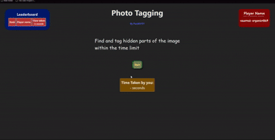
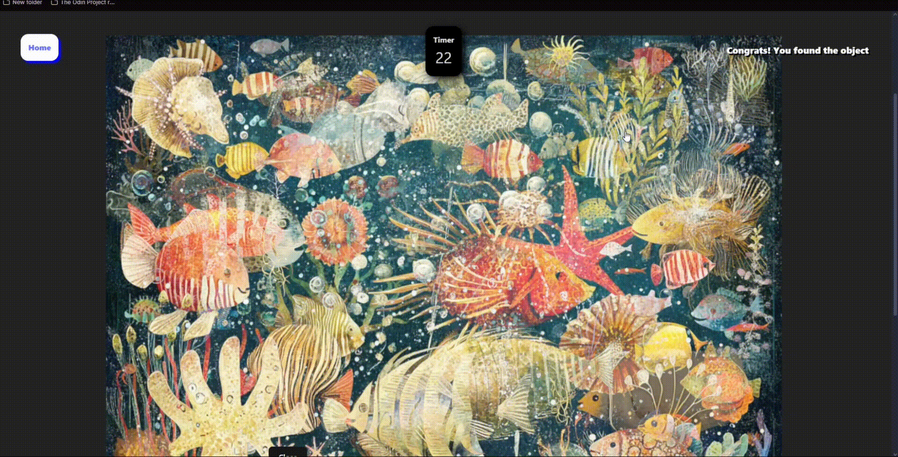

# 🎯 Photo Tagging Game

Race against the clock to find hidden objects in the image and compete for the top spot on the leaderboard.

## 🎬 Demo




## ⚡ Tech Stack

<div align="center">
  
  
  
  
</div>

## 🚀 Live Demo & Repository

**[🎮 Try it out now](https://photo-tagging-punith1117.netlify.app)**

**[🔧 Backend repo](https://github.com/Punith1117/photo-tagging-backend)**

## 📋 Project Overview

**Problem**: Create an engaging interactive game that challenges users' observation skills while demonstrating full-stack development capabilities.

**Solution**: A desktop-first photo tagging game where players race against time to find hidden objects in a complex image, complete with live scoring and persistent leaderboard.

**Key Features**:
- ⏱️ Live countdown timer with game state management
- 🎮 Interactive image tagging with coordinate-based object detection
- 🏆 Persistent leaderboard with player rankings
- 🔐 JWT-based player identity with auto-generated unique usernames
- 🎨 Styled-components for consistent UI design

## ⭐ Engineering Highlights

• Coordinate-based object detection algorithm  
• Dual-token authentication architecture (Player JWT + Game Session Token)  
• Efficient timer implementation with cleanup to prevent memory leaks  
• RESTful API consumption using structured fetch requests  
• Comprehensive unit and component testing with Vitest + RTL

## 🏗️ Technical Architecture

### System Design
```
Frontend (React) ←→ Backend API (Node.js/Express) ←→ Database (PostgreSQL)
```

### Frontend Architecture
- **React 19.1.0** with functional components and hooks
- **React Router** for client-side routing
- **Styled-components** for component styling
- **Vite** for fast development and building
- **Vitest + React Testing Library** for comprehensive testing

### Data Flow
1. User visits page → Auto-generated player identity with JWT token
2. New game session → Fixed set of objects to find assigned
3. Player clicks coordinates → API verifies object location
4. Game state updates → Timer, scoring, and found objects
5. Game completion → Score saved to leaderboard

## 🎮 Features Deep Dive

### Game Mechanics
- Fixed set of objects to find for each game session
- Coordinate-based click detection with precise location validation
- Multiple hidden objects to discover
- Automatic game state management and cleanup

### Game State Updates
- Live countdown timer with automatic game termination
- Dynamic object list updates as items are found
- Score tracking and validation
- Immediate visual feedback for user actions

### User Authentication
- JWT-based player identity system with auto-generated unique usernames
- Automatic player creation on first visit without manual registration
- Persistent player JWT stored in local storage for session management
- Short-lived game tokens for individual game sessions
- Dual-token architecture: player identity token + game session token

### Desktop-First Design
- Optimized for desktop viewing experience
- Large click targets for precise object selection
- High-contrast UI elements for visibility
- Fixed layout for consistent game board dimensions

## ⚙️ Technical Implementation

### State Management
- React hooks (useState, useEffect) for local component state
- Local storage for persistent user sessions
- Optimized re-renders with proper dependency arrays

### API Integration
- RESTful API consumption using structured fetch requests
- Error handling with user-friendly notifications
- Request/response interceptors for consistent data flow

### Error Handling
- Comprehensive try-catch blocks for API calls
- Toast notifications for user feedback on game events
- Input validation and sanitization

## 🧪 Testing

• Vitest for unit tests  
• React Testing Library for component interaction testing  
• Mocked API responses for integration testing

## 📈 Development Process

### Frontend-First Approach
- Started with complete frontend implementation
- Created comprehensive component library
- Implemented mock API responses for development
- Seamless backend integration with minimal frontend changes

### Challenges Overcome
- Complex coordinate-based object detection algorithm
- Game state synchronization across components
- JWT token management across components
- Efficient timer implementation with cleanup

### Lessons Learned
- Importance of state management architecture
- Value of comprehensive testing strategy
- Benefits of frontend-first development methodology

## 🚀 Deployment

- **Netlify** for continuous deployment
- Automated build process with Vite

## 💻 How to Run Locally

### Prerequisites
- Node.js 18+ and npm
- Git for version control

### Installation

1. **Clone the repository**
   ```bash
   git clone https://github.com/Punith1117/photo-tagging-frontend.git
   cd photo-tagging-frontend
   ```

2. **Install dependencies**
   ```bash
   npm install
   ```

3. **Start development server**
   ```bash
   npm run dev
   ```

4. **Open browser**
   Navigate to `http://localhost:5173`

### Available Scripts
- `npm run dev` - Start development server
- `npm run build` - Build for production
- `npm run test` - Run test suite
- `npm run lint` - Run ESLint

## 🖼️ Image Credits

The image is a combination of 3 images blended using Inshot (an android app). These images are taken from https://www.publicdomainpictures.net/en/view-image.php?image=655336&picture=funny-crowded-sea-of-fish-and-coral

---

*Project24 in The Odin Project - Full-stack development with React, Node.js, Express, and PostgreSQL*